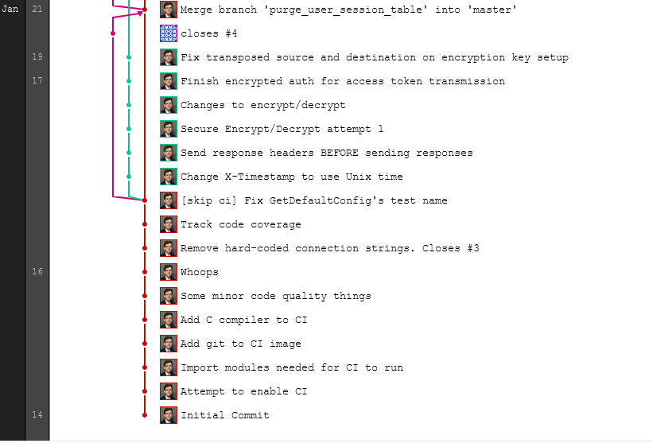
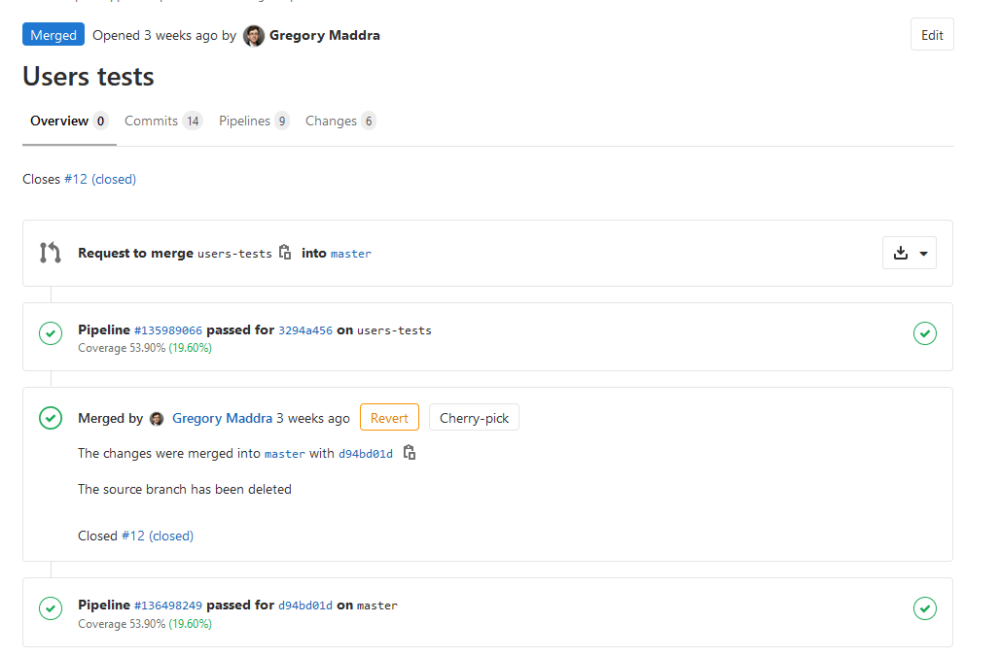

# Selected Work

## Commit Log

Due to initial delays getting AWS resources from our project sponsor, we were unable to start significant development on the client-server integration until we elected to use our own AWS resources in late February/Early March. Since then we worked to overhaul significant portions of the authentication module to allow client-server authentication to use secure encryption methods available through KMS.

We also then started implementation of tests on the key structures for the client-server communication:


Prior to that point we had worked to fix a number of bugs that the previous team had left in the code, as well as a number of quality-of-life improvements:

* The initial team had used a human readable format for the timestamp header in all requests. This was changed to Unix time as it made our initial API testing easier, and is a more standard method.
* Automated testing on push was enabled, and enforced code quality checks were enabled
* Hard-coded connection strings were removed and generated from config files
* A required, but non existent, database function was implemented
* Response headers were changed to be sent before terminating the connection to the client



## Key Merge Requests

We had initially stated a goal of getting 100% of the features required for our first demo to our project sponsor fully covered by tests.

While we were not able to accomplish this entirely, we achieved significant improvements to our testing and achieved full tests for the Users model - a key feature of the contact list system we intended to finish.

By implementing tests on these specific modules we were able to raise our test coverage from the low 20% range to over 50%, with the majority of these improvements coming from our finalization of the users tests:



## Automated Testing

A customized Docker image was created and committed to its own private repository. The image was based on Alpine Linux and contained Go 1.12 and the Go extensions our project requires. This image was then pushed to a private container registry available to all projects within our private GitLab group.

The main project was then configured to pull and start this image and a copy of PostgreSQL 10 whenever a commit was made to the repository. A test database would then be populated, our unit tests would be run, and a series of code quality and style checks would be executed. The results of these tests and the code coverage were reported. This allowed us to analyze how merge requests would impact our code coverage, and prevented us from merging bad code into the repository.

A version of the CI configuration, with sensitive data removed, is included:

```yaml
services:
    - postgres:10-alpine

stages:
    - test

variables:
    POSTGRES_DB: REMOVED
    POSTGRES_USER: REMOVED
    POSTGRES_PASSWORD: ""
    POSTGRES_HOST_AUTH_METHOD: trust

vetCode:
    stage: test
    image: $CI_REGISTRY/cs4263-ratpack-app/build-environments/server:latest
    script:
        - cd src/
        - go vet ./...

codeTests:
    stage: test
    image: $CI_REGISTRY/cs4263-ratpack-app/build-environments/server:latest
    script:
        - psql --host=postgres --port=5432 -d "$POSTGRES_DB" -U "$POSTGRES_USER" -c "REMOVED"
        - psql --host=postgres --port=5432 -d "$POSTGRES_DB" -U "$POSTGRES_USER" -f "REMOVED"
        - psql --host=postgres --port=5432 -d "$POSTGRES_DB" -U "$POSTGRES_USER" -f "REMOVED"
        - cd src/
        - go test ./... -v -coverprofile cover.out
        - go tool cover -func cover.out | grep total

```

# Future Work

The main remaining task is to implement the same encryption algorithm on the client. This is estimated to be only about an hour of work, but does require a working server setup which blocked us from making much progress on this as we initially had to wait for AWS resources and then finish the serverside implementation of the same. Depending on Altus's future requirements and the release of the next iteration of FIPS-140, this may have to be changed to another algorithm before full deployment.